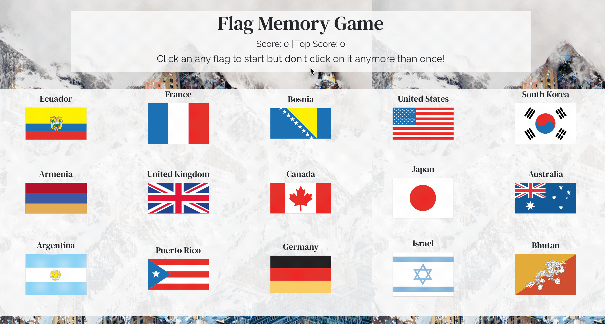

# Welcome to the Flag Memory Game! :us:

A game that tests your memory skills using 15 flags from countries around the world. 

## How to play:

* Click any flag to start the game! 
* You'll earn 1 point for every flag you click on. 
* The flags will shuffle after each click. Be careful not to click a flag for the second time you're out!!

[Check it out here](http://github.com)

## Built with:

* React 

* Javascript

## Links:

**Incredible Author** Kristina Calumpong https://github.com/kcalumpong

**See the Code on Github** https://github.com/kcalumpong/clicky-game

